# Introductory Example

This section is a general introduction for understanding expected inputs and outputs of the pipeline, here for the test case `marmande_2021` ([see here](test_marmande.md#inputs-of-marmande_2021)), however it is fully translatable to any other flood events and extents. The data for this introcdutory example is available by running `just download --marmande_2021`.

As an illustration, some of the plots below, marked as "automatically generated" -- or equivalent -- are those produced by SEICHE when `param.autoplot: true`. 

## Goal of the pipeline

SEICHE is a pipeline designed to assess flood impacts by integrating land cover data, economic damage functions, and population rasters. The pipeline can process a wide range of input datasets though some of these datasets may be unfamiliar to new users. This example hopefully clarifies what to expect from the pipeline.

## Inputs

### Work polygon

The first input required is a georeferenced polygon that defines your study area. The pipeline will process all datasets within this polygon boundaries. For example, your input datasets may cover an entire region, but the analysis will only consider the area within the polygon. This approach lets you easily run multiple experiments with different study areas while keeping all other parameters constant—such as analyzing different cities with identical processing settings.

In the case of our `marmande_2021` test case, here is the work polygon: 

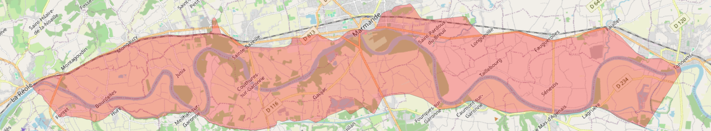

*Figure 1: Work polygon (in red) for `marmande_2021`*

### DEM

A Digital Elevation Model (DEM) is almost always required. A DEM is a raster dataset that represents land elevation at each pixel and is essential for converting satellite-derived flood maps into water depth maps. It may also be used in post-processing 2D hydrodynamic models. 

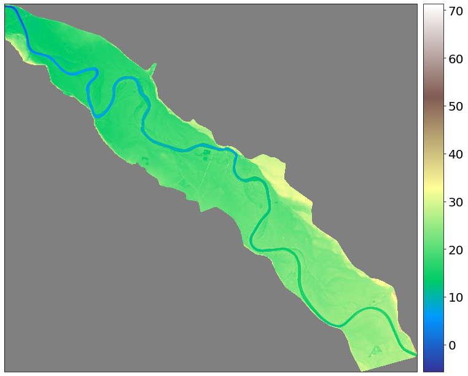

*Figure 2: Automatically generated plot showing IGN's RGE Alti DEM on the `marmande_2021` extent (in meters).*

### Water Hazard

A flooding event must be simulated or observed to assess its impacts. SEICHE was designed specifically for slow-moving, overflowing flood events—the type that can be reliably observed using satellite imagery, given its coarse temporal resolution. The pipeline was built to work with binary flood masks dervied from remote sensing; and 2D hydrodynamic simulations, particularly those from the [Telemac2D](https://www.opentelemac.org/index.php/presentation?id=17) software, though it can be adapted -- given a bit of work -- to other modeling suites, for example ones that can represent flash runoff floods.

#### Telemac2D's .slf files

Telemac2D is a Shallow Water Equations solver based on an unstructured mesh, written in Fortran, and part of the [OpenTelemac](https://www.opentelemac.org/) suite. A model is created by configuring a Telemac2D instance with specific parameters: a DEM, friction coefficients, and other settings that hydrologists calibrate against observed reference events. Once calibrated, the model can simulate flood hazards for any future event, given upstream water flow as input. In this `marmande_2021` example, two models are available: a legacy Low Fidelity (LF) model and a more recent High Fidelity (HF) model.

Estimating flood damage requires three key variables: water depth, flow speed, and flood duration. Hydrodynamic models provide these values at each mesh node for every timestep, making them straightforward tools for flood damage assessment.

*Figure 3: Illustration of water depth simulated by the LF Telemac2D model for the 2021 flooding event that occured on our extent of interest. (marmande_2021_inp/lf_2021_fr1.slf)*

#### Binary Flood Masks

Creating and calibrating SWE models requires significant time and resources, limiting their availability to specific geographic areas. When floods occur outside these calibrated regions -- which happens frequently -- damage assessment becomes much more difficult. In-situ observations and cheaper 1D models may be available, but their accessibility varies significantly by country. For global -- and fast -- analyses using open datasets, satellite-based flood maps provide an alternative approach.

This pipeline is designed to work with Binary Flood Masks (BFMs) -- rasters containing values of 0 (dry ground), 1 (wet ground), or NaN (no data). Multiple tools exist to convert satellite imagery to BFMs. Test data for this example were generated from Sentinel-1 and Sentinel-2 imagery and converted using CNES' [FloodML](https://github.com/CNES/floodml) tool.

However, damage assessment requires three variables: water depth, flow speed, and flood duration. While flood duration can be derived directly from a time series of BFMs, flow speed cannot be extracted from satellite data alone and requires additional hydrodynamic modeling. Water depth must be estimated using a DEM and specialized algorithms designed for this purpose. This multi-step derivation process makes satellite-based flood maps more challenging to work with compared to SWE models, which directly provide all three variables.

*Figure 4: Binary Flood Mask inferred by FloodML based on Sentinel 1 image (Febuary 3rd 2021, 17:48), white is wet, black is dry (marmande_2021_inp/floodml/Inf_S1_L1C_30TYQ_20210203T174749_132_POST_MAJr03.tif)*

### Land cover

Once flooding hazard is modeled or observed, we need to characterize what lies beneath the water. For economic impact assessment, relevant data include anthropogenic infrastructure such as buildings, fields, and roads. For social impact assessment, we need population distribution data to determine how many people were exposed to flooding conditions.

SEICHE was designed to work with both international global land cover datasets and national, more specialized French datasets. Datasets that SEICHE has been created around are described in the subsections below.

#### ESAWC 

The European Space Agency World Cover (ESAWC) "provides the first global land cover products for 2020 and 2021 at 10 m resolution, developed and validated in near-real time based on Sentinel-1 and Sentinel-2 data." (from: [https://esa-worldcover.org/en](https://esa-worldcover.org/en)). Through its "Built-up" and "Cropland" classes, ESAWC enables identification of where infrastructure and agricultural fields are located globally. However, it has important limitations: orchards and forestry activities are indistinguishable from natural forests and cannot be reliably identified; industrial and commercial sites cannot be distinguished from housing; and building density and crop types cannot be discriminated. Despite these constraints, its global coverage enables rapid preliminary damage assessments across regions where other detailed datasets are unavailable.

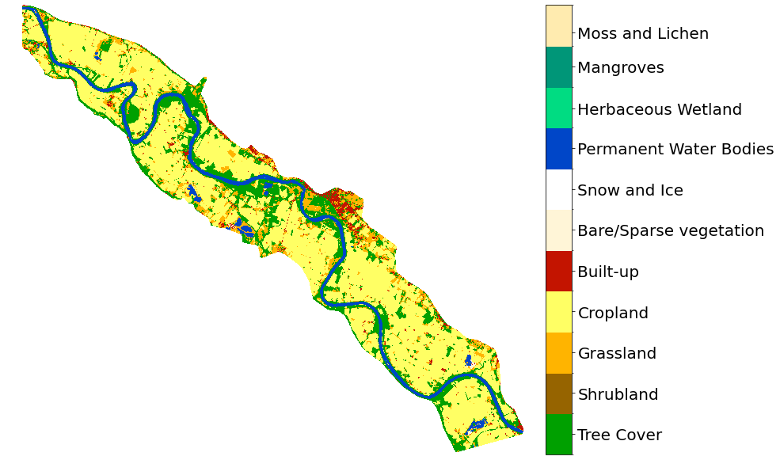

*Figure 5: Automatically generated plot showing the ESAWC on the `marmande_2021` extent.*

#### OSO

The _Centre d'Etudes Spatiales de la Biosphère's (CESBIO) Occupation des Sols (OSO)_ is designed as an alternative to ESAWC. The latest version includes 23 classes that distinguish industrial and commercial areas from sparse and dense urban areas, and discriminate among specific crop types including corn, rice, soy, cereals, orchards, and grapevines. Currently, OSO is only available for France; however, its methods are fully open and reproducible, suggesting potential for global expansion as an eventual replacement for ESAWC.

*Figure 6: Automatically generated plot showing the OSO on the `marmande_2021` extent.*

#### BDTopo

The _Base de Données TOPOgraphique_ (BDTopo) from France's _Institut national de l'information géographique et forestière_ (IGN) is a comprehensive vectorized database representing every building in France. It includes detailed attributes such as the number of floors, occupancy type (residential or non-residential), and operational status. BDTopo is the authoritative reference database for computing flood damage assessments in France, offering unparalleled precision compared to global alternatives.

#### Sirène

The _Système national d'identification et du répertoire des entreprises et de leurs établissements_ (Sirène) from France's _Institut national de la statistique et des études économiques_ (INSEE) is a vectorized database representing every company, public organization, association, shop, and similar entity in France. Each record is represented as a georeferenced point containing attributes such as employee count estimates and activity sector classification. Sirène is highly valuable for assessing flood damages to the commercial and industrial sectors.

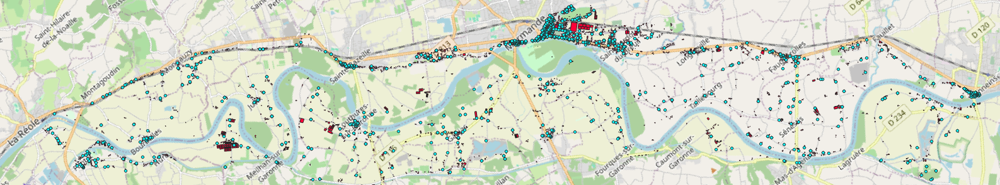

*Figure 7: Each cyan dot is a Sirène record, and each red polygon is a BDTopo record.*

#### RPG

The _Registre Parcellaire Graphique_ (RPG) from France's IGN completes the holy trinity of essential French datasets for assessing the economic damages of flooding. It is a vectorized database representing every agricultural field in France along with its crop type classification. RPG is the authoritative reference for assessing flood damages to agricultural sectors.

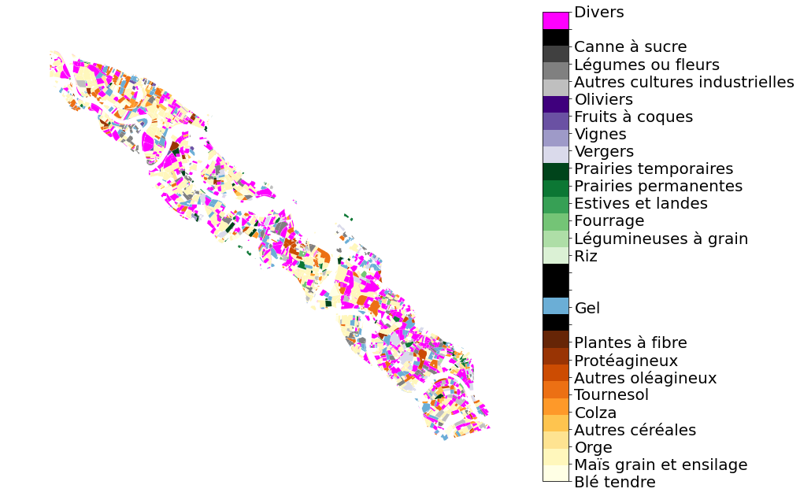

*Figure 8: Automatically generated plot showing the RPG on the `marmande_2021` extent.*

#### GHSL-Pop

"The Global Human Settlement Layer (GHSL) is a strategic knowledge infrastructure built by the European Commission Joint Research Centre (JRC) to make human presence on Earth visible, measurable, and actionable." (from: [https://human-settlement.emergency.copernicus.eu/about.php](https://human-settlement.emergency.copernicus.eu/about.php)). The population layer provides global coverage at 200-meter resolution, indicating the number of people per pixel. Data are available at 5-year intervals, with long-term projections extending through 2100. 

*Figure 8: Automatically generated plot showing the GHSL-Pop on the `marmande_2021` extent (in people/pixel).*

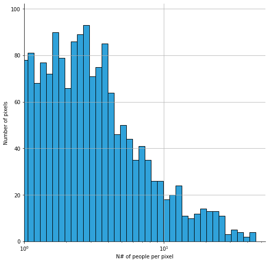

*Figure 9: Automatically generated histogram of the GHSL-Pop on the `marmande_2021` extent.*

#### Filosofi

The _FIchier LOcalité SOcial et FIscal_ (Filosofi) from INSEE is the French equivalent to GHSL-Pop, specifically its 200-meter rasterized dataset. In addition to providing population counts per pixel, Filosofi includes complementary demographic and economic information -- age distribution and income level per pixel. These attributes enable more nuanced affected population assessments by accounting for demographic and socioeconomic variables. It is available every 2 years. 

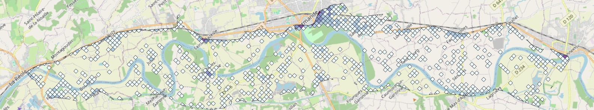
*Figure 10: Filosofi dataset on the `marmande_2021` extent, the darker the square, the more populated*

## Damage functions

The core method for building economic damage estimates in this pipeline is damage functions. These are empirical abacuses developed by specialists from various fields, such as insurance, economics, urban planning, and more, to simplify damage assessments for non-experts. They enable to easily convert water hazard variables such as depth, speed, and flood duration into euros or US dollars.

Two datasets are used in SEICHE and are described in the following subsections.

> ℹ️ _There is no need of manually downloading these datasets, they are core components of the code, and as such, are directly included in the repository._

### JRC

[Huizinga et al., 2017](https://publications.jrc.ec.europa.eu/repository/handle/JRC105688), on behalf of the Joint Research Center (JRC) of the European Comission, produced in 2017 a dataset of global flood depth damage functions. The purpose of this dataset is to provide a rough estimate of the economic impact of flooding anywhere on Earth. Here’s how it works: for each pixel or vector, you only calculate the maximum flood depth -- no speed or flood duration -- and apply it to a damage factor curve to obtain a damage factor (a scalar between 0 and 1). You then multiply this by a maximum damage value (in euros) to generate an estimate. Additionally, there is a standard deviation output to provide uncertainty estimates, though this field is often left blank in most cases.

The dataset supports six classes: housing, commercial, industrial, agriculture, roads, and transport. However, these categories are somewhat broad. To achieve global coverage, the functions use highly aggregated data, applying damage factors at the continental level and maximum damages at the country level. It’s worth noting that the underlying data dates back to 2010, which is becoming somewhat outdated. As of now, however, no alternative global dataset exists.

While these functions are an invaluable tool for their unique capabilities and ease of use, it’s important to be aware of their limitations before using them.

 

*Figure 11: Illustration of a depth damage function, copied from Huizinga et al. 2017.*

### Floodam

_"floodam is a set of libraries that aim to assist in the estimation of flood impacts and the economic evaluation of flood management projects. This set of libraries is under continuous development." ([floodam.org](https://www.floodam.org/))_. Theses libraries can either be run, or one can gather the damage functions already compiled on the [French ministry of ecology's website](https://www.ecologie.gouv.fr/levaluation-economique-des-projets-gestion-des-risques-naturels) -- it is the case for SEICHE. They were built for a-priori cost-benefit analyses when building flood protection measures, but they can be re-compiled for different needs using the R library floodam directly. 

More specifically, they are built by France's _Institut national de recherche pour l'agriculture, l'alimentation et l'environnement_ (INRAE), in UMR G-EAU laboratory. They vary between seasons, if the hazard is fluvial or maritime, and take into account the maximum water depth, speed and the flood duration for the considered event. They have a very fine resolution in terms of land cover classes, than can be leveraged by specific French datasets, such as previously mentioned BDTopo, Sirene and RPG. Unfortunately they are only suited to work on France's territory. 

## Outputs

This section illustrates the main outputs of the pipeline for the `marmande_2021` test case.

### Hazards

The first output is the hazard raster, a 3-band geotiff combining the three flood variables that feed the damage functions. `H(x, y)` the max water depth field is the first band, `V(x, y)` the max water speed (norm, not direction) field is the second band, and `T(x, y)` the flood duration field is the third and last band. This is a convention I choose some time ago, but it could easily be replaced by a NetCDF file. One small advantage of this 3 band raster is a direct RGB representation that gives pretty pictures - `H` is the red band, `V` is the green band, `T` is the blue band.

*Figure 12: RGB representation of a hazard 3-band raster.*

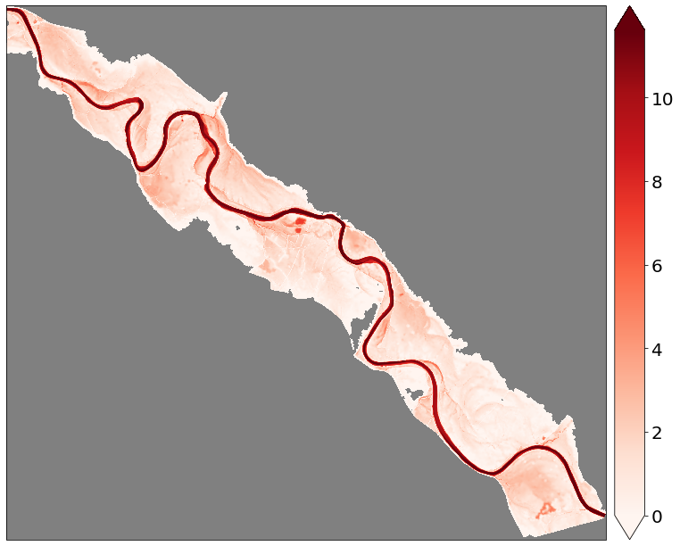
*Figure 13: Automatically generated plot showing the 1st band of a hazard raster, H(x, y) the field of maximum water depth during the event, here based on the new HF model (in meters).*

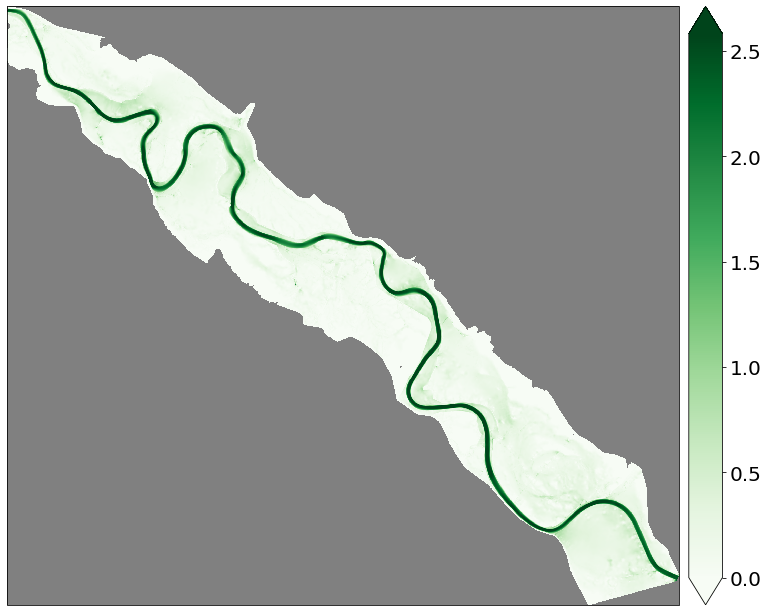
*Figure 14: Automatically generated plot showing the 2nd band of a hazard raster, V(x, y) the field of maximum water velocity during the event, here based on the new HF model (in meters per second).*

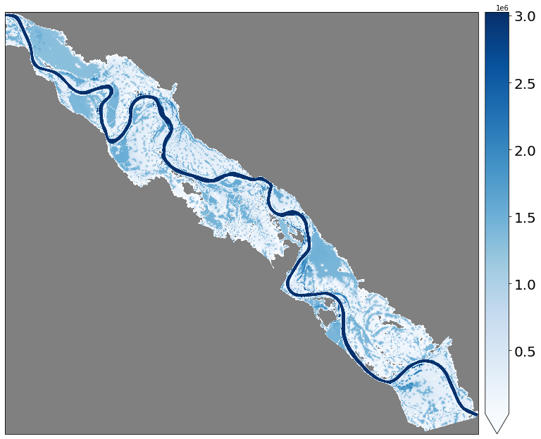
*Figure 15: Automatically generated plot showing the 3rd band of a hazard raster, T(x, y) the field of flood duration during the event, here based on the new HF model (in seconds).*

### Economic impacts

#### JRC

The JRC damage functions are applied per land cover. For each (hazard, land cover) pair, the pipeline outputs two rasters, a damage factor raster and a maximum damage raster, that are combined into the final damage estimate.

The **damage factor** `dmgfac(x, y)` is a scalar between 0 and 1 obtained by applying the depth-damage curve to the maximum water depth at each pixel:

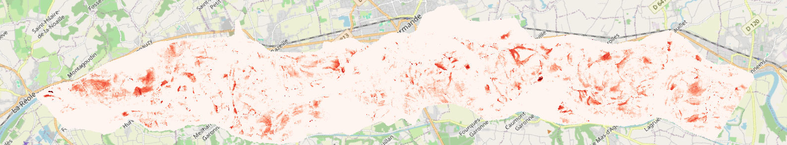
*Figure 16: Automatically generated plot showing the damage factor (`dmgfac`) for the ESAWC land cover on the `marmande_2021` extent. `dmgfac` is dimensionless, between 0 (no damage) and 1 (total destruction).*

The **maximum damage** `maxdmg(x, y)` is the value (in euros per m2) that would be fully destroyed for the class occupying each pixel, i.e. the damage when `dmgfac = 1`:

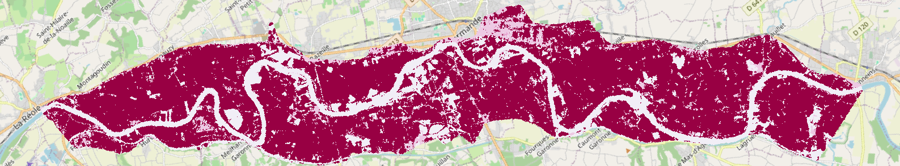
*Figure 17: Automatically generated plot showing the maximum damage (`maxdmg`) for the ESAWC land cover on the `marmande_2021` extent (in €/m2).*

To obtain the final economic damage, simply multiply the two rasters pixel-wise, `dmg = dmgfac × maxdmg` (in €/m2). The figure below shows the result computed in a raster calculator (e.g. in QGIS):

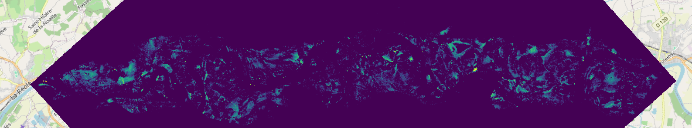
*Figure 18: Economic damage (`dmg = dmgfac × maxdmg`) for the ESAWC land cover on the `marmande_2021` extent (in €/m2).*

In addition, the JRC damage functions provide a **standard deviation** `std(x, y)` alongside the damage factor, giving an uncertainty estimate on the damage factor. In practice this field is mostly left blank in the underlying dataset, so the standard deviation raster is often empty (constant `NaN`).

> ℹ️ Note that the JRC outputs above are the intermediate rasters saved by the pipeline. Combining them into a single damage raster (`dmg = dmgfac × maxdmg`) is done by the user (or downstream tools).

#### Floodam

Unlike JRC, Floodam directly combines the three hazard variables (depth, speed and duration) and the land cover class into a final damage value, so the pipeline outputs a single damage layer per land cover. For the vector French datasets (BDTopo, Sirène, RPG) the damage is computed per object and saved as a geopackage. For example:

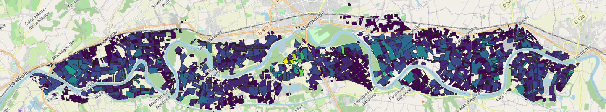
*Figure 19: Economic damage computed with the Floodam damage functions (in €) on the `marmande_2021` extent.*

### Social impacts 

Finally, the pipeline estimates the affected population for each population dataset and each user-defined condition (here, being in water deeper than 30 cm). For the raster GHSL-Pop, this yields both a map of affected people per pixel and its histogram:

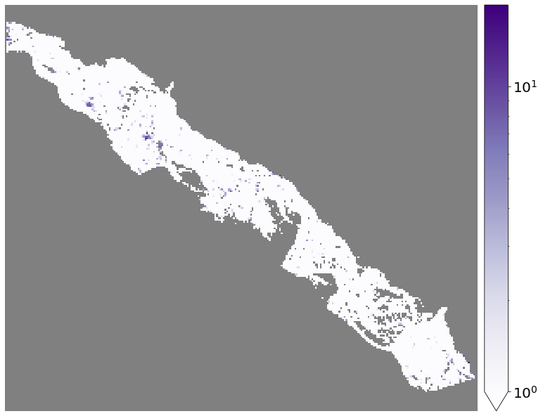
*Figure 20: Number of affected people per pixel on the `marmande_2021` extent, for the condition `is_above_30cm` (water depth above 30 cm).*

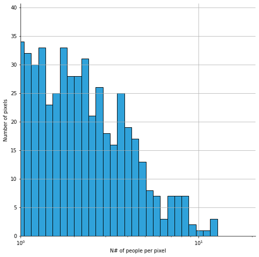
*Figure 21: Histogram of the number of affected people per pixel for the condition `is_above_30cm`.*
