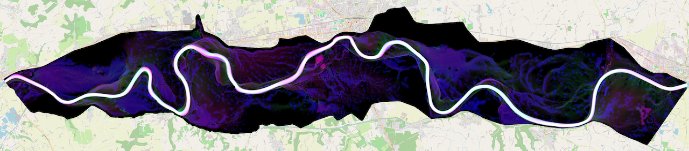
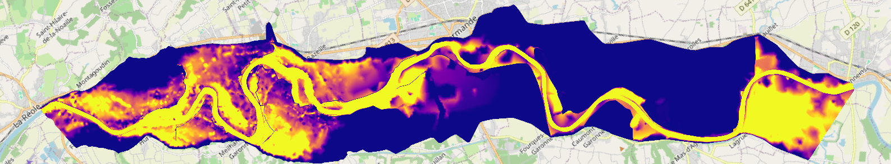
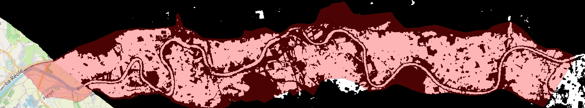
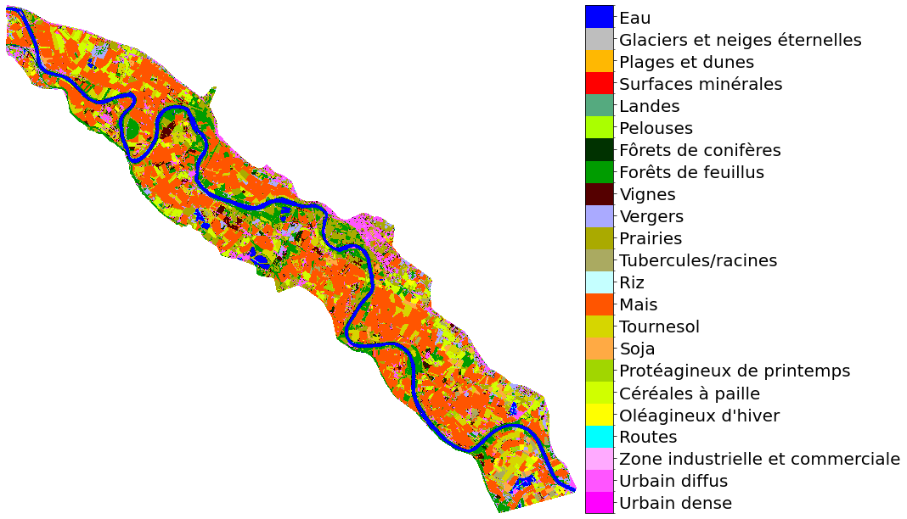
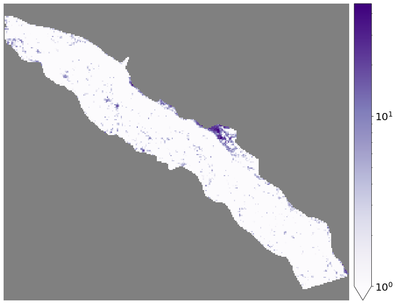
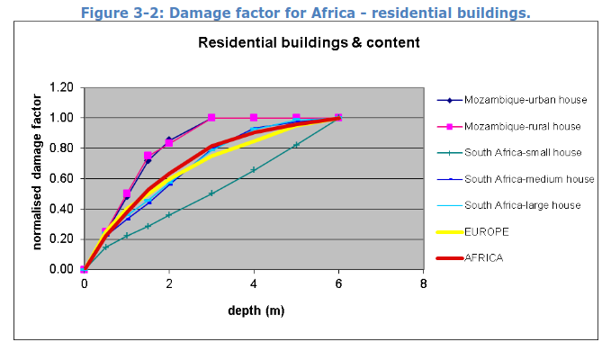
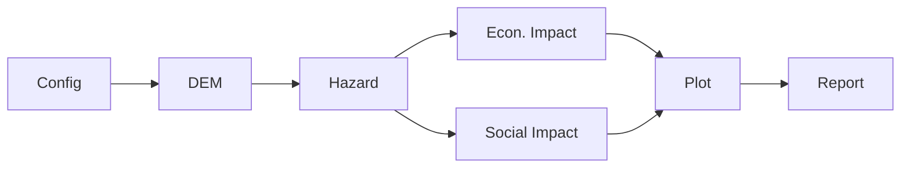

<div class="center">

# Seiche
_Socio Economic Impacts of Catastrophic Hydrological Events_

</div>

<div class="cols">
<div class="span-8 right">

</div>
<div class="span-4 left v-center">

**T. Garin**

CNES CECI UT2J

v0.1.0

29/09/2026

</div>
</div>

---

## Goal

Flood impact = **`damage_function(hazard, land_cover)`**

- **Hazard** - description of flood event (depth, speed, duration)

- **Exposure** - land cover (what is flooded) + population (who is flooded)

- **Damage Function** - translate hydrodynamic variables into economic or social damage per land cover class or population category.



_RGB of a hazard 3-band raster — $H(x, y)$ red · $V(x, y)$ green · $T(x, y)$ blue_

---

## Hazard sources



_Telemac2D `.slf`: water depth per node per timestep solved using SWEs_



_FloodML Binary Flood Mask (BFM) `.tif`: wet (white) / dry (black) per date_

In the end, we need $H(x, y), V(x, y), T(x, y)$ 

---

## Land cover

<div class="cols">

<div class="span-9 right">

What lies beneath the water and drives economic damage:



_OSO (CESBIO) land cover description on Marmande in 2021_

</div>

<div class="span-3 v-center">

- **ESAWC**

- **OSO23**

- **BDTopo**

- **Sirène**

- **RPG**

- easily add more

</div>

</div>

---

## Population

<div class="cols">

<div class="span-7 right">

Who is exposed - drives social impact:



_GHSL-Pop (people/pixel)_

</div>

<div class="span-5 v-center">

- **GHSL-Pop**

- **Filosofi**

- easily add more

- Conditions on `H` / `V` / `T` → affected people

</div>

</div>

---

## Damage functions

<div class="cols">
<div class="span-6">

- **JRC** (Huizinga 2017): global, depth-only, `dmgfac × maxdmg` (€/m²), 6 broad classes, 2010 data

</div>
<div class="span-6">

- **Floodam** (INRAE): France only, `H` / `V` / `T`, fine classes (BDTopo · Sirène · RPG), per-object damage

</div>
</div>

<div class="center span-8">



_Depth-damage curve (Huizinga et al. 2017)_

</div>


---

## What is Seiche?

Seiche turns heterogeneous **flood** model outputs, **land cover** and **population** data into hazard rasters and **socio-economic impact estimates**.

- Built to be easily extensible and modulable

- Testing, documentation, reporting, profiling, gitlab CI/CD

- Dependencies: 

`dask · exactextract · geopandas · geoviews · hvplot · matplotlib · netcdf4 · pyproj · pysheds · pyyaml · rioxarray · typst · xarray`

```bash
$ cd seiche && ls
AGENTS.md  install_seiche.sh  pyproject.toml  src      tools
data       justfile           README.md       tests    uv.lock
dev        logs               site            tmp
docs       mkdocs.yml         slurms          TODO.md
```

---

## Codebase layout

`src/seiche/` — 23 modules · ~5.2k LOC of Python ≥ 3.13 · no subpackages

| Convention | Role |
| --- | --- |
| `main_*.py` | pipeline parts (`main.py` orchestrates) |
| `format_*.py` | inputs → common formats (DEM · BFM · `.slf` · landcover) |
| `utils_*.py` | helpers per data type (state · geom · gdf · enum · da · plot · qol) |
| `affected_population.py` | affected people (Filosofi · GHSL) |
| `defended.py` | depth estimation (FwDET · HAND · simple) |
| `maps.py` | landcover ↔ damage-class correspondence |
| `dmgfunc_floodam.py` | Floodam damage function |
| `dmgfunc_jrc.py` | JRC damage function |

---

## Pipeline

A functional chain of parts, each `(state: dict) -> dict`:


- After each part, the `state` is dumped to `state.yml`

- **Runs are resumable** (crash → reload → continue)

- Hot run resumes from `state.yml`

---

## Configuration

**Config-driven**: never touch the code, a single `.yml` file drives everything.

- **Config Builder** (`tools/seiche_config_builder.py`): 
a `marimo` notebook app, launched with `just config`

- Validated against `src/seiche/config_template.yml`

```yaml
param.expname: marmande_2019
path.inp: /archive/garin/marmande_2019_inp
path.out: /archive/garin/marmande_2019_out
path.inp.POLY: marmande.geojson
param.cold_run: false
param.autoplot: true
param.autoreport: true
```

---

## Inputs

| Input | File format |
| --- | --- |
| DEM (user tiles, e.g. Copernicus DEM 30 m) | GeoTIFF `.tif` / ASCII `.asc` |
| Binary Flood Masks (satellite, e.g. FloodML) | GeoTIFF `.tif` |
| Telemac2D outputs (OpenTelemac) | Selafin `.slf` |
| Landcover ESAWC (ESA WorldCover) · OSO23 (CESBIO) | GeoTIFF `.tif` |
| Landcover BDTOPO · RPG (IGN) | vector `.shp` / `.gpkg` |
| Landcover SIRENE (INSEE) | CSV |
| Population GHSL-Pop (JRC) | GeoTIFF `.tif` |
| Population Filosofi (INSEE) | GeoPackage `.gpkg` |
| Work polygon `POLY` | any geopandas-readable vector |

---

## Outputs

| Output | File format |
| --- | --- |
| Hazard: 3-band H/V/T raster per source + duration | GeoTIFF `.tif` |
| Landcover (normalized, per dataset) | GeoTIFF `.tif` / GeoPackage `.gpkg` |
| Econ. impact — JRC: damage factor · max damage · std | GeoTIFF `.tif` |
| Econ. impact — Floodam: per-object damage | GeoPackage `.gpkg` |
| Pop. impact — per dataset × condition | `.tif` (GHSL-Pop) / `.gpkg` (Filosofi) |
| Auto-plots (matplotlib / hvplot) | `.png` |
| Report | Typst `.typ` → PDF `.pdf` |
| Resume state | `state.yml` |

---

## Known issues 

- Tests were made on Linux, seems like there are some SHA256 mismatches when on MacOS (not tested on Windows), probably because of file metadata. Seems to be a FWDET issue ?
> _$\Rightarrow$ Need to extract content, encode to utf-8 string then SHA256? Or Docker?_

- Some warning I put a long time ago, need to check if they are still relevant and if they hide ill-defined behaviour.

- Would need to expand automatic plots and reporting.

<hr>

<div class="center v-center">

**All and all not perfected, but ready to be peer-reviewed and industrialized!**

</div>

---

## Hands-on 

```bash
$ git clone https://github.com/t-garin/seiche.git
$ ./install_seiche.sh
```

<div class="cols">

<div class="span-6">

- To see the docs
```bash
$ just docs
```

</div>
<div class="span-6">

- To run the tests
```bash
$ just test
```

</div>
</div>

- To see the other recipes:
```bash
$ just
just --list
Available recipes:
    config                  # open the configuration builder
    run *ARGS               # run seiche
    ...
```

---

<!-- _class: v-center center -->

# Thanks for your attention :)
## _Questions ?_